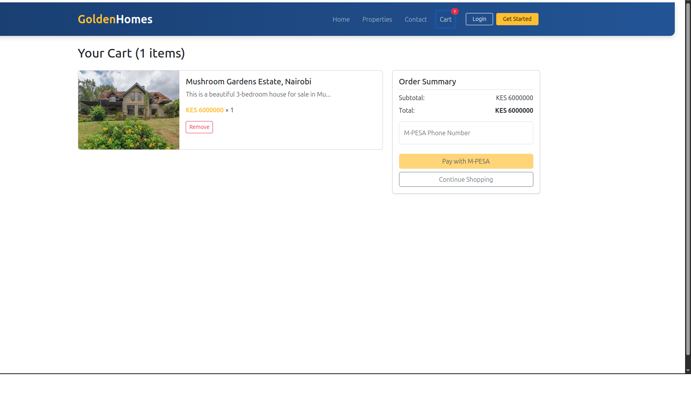

# Getting Started with Create React App

This project was bootstrapped with [Create React App](https://github.com/facebook/create-react-app).

## Available Scripts

In the project directory, you can run:

### `npm start`

Runs the app in the development mode.\
Open [http://localhost:3000](http://localhost:3000) to view it in your browser.

The page will reload when you make changes.\
You may also see any lint errors in the console.

### `npm test`

Launches the test runner in the interactive watch mode.\
See the section about [running tests](https://facebook.github.io/create-react-app/docs/running-tests) for more information.

### `npm run build`

Builds the app for production to the `build` folder.\
It correctly bundles React in production mode and optimizes the build for the best performance.

The build is minified and the filenames include the hashes.\
Your app is ready to be deployed!

See the section about [deployment](https://facebook.github.io/create-react-app/docs/deployment) for more information.

### `npm run eject`

**Note: this is a one-way operation. Once you `eject`, you can't go back!**

If you aren't satisfied with the build tool and configuration choices, you can `eject` at any time. This command will remove the single build dependency from your project.

Instead, it will copy all the configuration files and the transitive dependencies (webpack, Babel, ESLint, etc) right into your project so you have full control over them. All of the commands except `eject` will still work, but they will point to the copied scripts so you can tweak them. At this point you're on your own.

You don't have to ever use `eject`. The curated feature set is suitable for small and middle deployments, and you shouldn't feel obligated to use this feature. However we understand that this tool wouldn't be useful if you couldn't customize it when you are ready for it.

## Learn More

You can learn more in the [Create React App documentation](https://facebook.github.io/create-react-app/docs/getting-started).

To learn React, check out the [React documentation](https://reactjs.org/).

### Code Splitting

This section has moved here: [https://facebook.github.io/create-react-app/docs/code-splitting](https://facebook.github.io/create-react-app/docs/code-splitting)

### Analyzing the Bundle Size

This section has moved here: [https://facebook.github.io/create-react-app/docs/analyzing-the-bundle-size](https://facebook.github.io/create-react-app/docs/analyzing-the-bundle-size)

### Making a Progressive Web App

This section has moved here: [https://facebook.github.io/create-react-app/docs/making-a-progressive-web-app](https://facebook.github.io/create-react-app/docs/making-a-progressive-web-app)

### Advanced Configuration

This section has moved here: [https://facebook.github.io/create-react-app/docs/advanced-configuration](https://facebook.github.io/create-react-app/docs/advanced-configuration)

### Deployment

This section has moved here: [https://facebook.github.io/create-react-app/docs/deployment](https://facebook.github.io/create-react-app/docs/deployment)

### `npm run build` fails to minify

This section has moved here: [https://facebook.github.io/create-react-app/docs/troubleshooting#npm-run-build-fails-to-minify](https://facebook.github.io/create-react-app/docs/troubleshooting#npm-run-build-fails-to-minify)


## To add the cart functionality;

### <h2>Step One</h2>

Craete a contexts folder inside the components folder then create a file named **`CartContext.jsx`** and add the code below;

```jsx
        import { createContext, useState, useEffect } from 'react';

        export const CartContext = createContext();

        export const CartProvider = ({ children }) => {
        const [cart, setCart] = useState([]);

        // Load cart from localStorage on initial render
        useEffect(() => {
            const savedCart = localStorage.getItem('cart');
            if (savedCart) {
            setCart(JSON.parse(savedCart));
            }
        }, []);

        // Save cart to localStorage whenever it changes
        useEffect(() => {
            localStorage.setItem('cart', JSON.stringify(cart));
        }, [cart]);

        const addToCart = (product) => {
            setCart(prevCart => {
            const existingItem = prevCart.find(item => item.id === product.id);
            if (existingItem) {
                return prevCart.map(item =>
                item.id === product.id 
                    ? { ...item, quantity: item.quantity + 1 }
                    : item
                );
            }
            return [...prevCart, { ...product, quantity: 1 }];
            });
        };

        const removeFromCart = (productId) => {
            setCart(prevCart => prevCart.filter(item => item.id !== productId));
        };

            // Add to CartContext.jsx
        const clearCart = () => {
        setCart([]);
        };

        const cartItemCount = cart.reduce((total, item) => total + item.quantity, 0);

        return (
            <CartContext.Provider value={{ cart, addToCart, removeFromCart,clearCart, cartItemCount }}>
            {children}
            </CartContext.Provider>
        );
        };
```

### <h2>Step Two</h2>
Create a Cart Component and add the below code ;


</br>

```jsx

import { useContext, useState } from "react";
import { Link} from "react-router-dom";
import { CartContext } from "./contexts/CartContext";
import axios from "axios";

const Cart = () => {
  const { cart, removeFromCart, cartItemCount, clearCart } = useContext(CartContext);
  const [phone, setPhone] = useState("");
  const [message, setMessage] = useState("");
  const navigate = useNavigate();
  const img_url = "https://Atom19J60.pythonanywhere.com/static/images/";

  // Calculate total price
  const totalPrice = cart.reduce(
    (sum, item) => sum + item.product_cost * item.quantity,
    0
  );

  const handlePayment = async (e) => {
    e.preventDefault();
    setMessage("Processing payment...");

    try {
      const data = new FormData();
      data.append("phone", phone);
      data.append("amount", totalPrice);

      const response = await axios.post(
        "https://Atom19J60.pythonanywhere.com/api/mpesa_payment",
        data
      );

      setMessage(response.data.message);
      
      // Clear cart after successful payment
      setTimeout(() => {
        clearCart();
      }, 5000);

    } catch (error) {
      setMessage("Payment failed. Please try again.");
      console.error("Payment error:", error);
    }
  };

  return (
    <div className="container py-4">
      <h2 className="mb-4">
        Your Cart {cartItemCount > 0 && `(${cartItemCount} items)`}
      </h2>

      {cart.length === 0 ? (
        <div className="alert alert-info">
          Your cart is empty. <Link to="/properties">Browse Products</Link>
        </div>
      ) : (
        <div className="row">
          {/* Cart Items */}
          <div className="col-lg-8">
            {cart.map((item) => (
              <div key={item.id} className="card mb-3">
                <div className="row g-0">
                  <div className="col-md-4">
                    
                  </div>
                  <div className="col-md-8">
                    <div className="card-body">
                      <h5 className="card-title">{item.product_name}</h5>
                      <p className="card-text text-muted">
                        {item.product_description.slice(0, 50)}...
                      </p>
                      <p className="card-text">
                        <span className="text-warning fw-bold">
                          KES {item.product_cost}
                        </span>{" "}
                        × {item.quantity}
                      </p>
                      <button
                        className="btn btn-outline-danger btn-sm"
                        onClick={() => removeFromCart(item.id)}
                      >
                        Remove
                      </button>
                    </div>
                  </div>
                </div>
              </div>
            ))}
          </div>

          {/* Order Summary and Payment */}
          <div className="col-lg-4">
            <div className="card shadow-sm">
              <div className="card-body">
                <h5 className="card-title border-bottom pb-2">Order Summary</h5>
                <div className="d-flex justify-content-between mb-2">
                  <span>Subtotal:</span>
                  <span>KES {totalPrice}</span>
                </div>
                <div className="d-flex justify-content-between mb-3">
                  <span>Total:</span>
                  <span className="fw-bold">KES {totalPrice}</span>
                </div>

                {/* Payment Form */}
                <form onSubmit={handlePayment}>
                  {message && (
                    <div className="alert alert-warning mb-3">{message}</div>
                  )}

                  <div className="form-floating mb-3">
                    <input
                      type="text"
                      className="form-control"
                      id="phoneNumber"
                      placeholder="Enter Phone Number"
                      value={phone}
                      onChange={(e) => setPhone(e.target.value)}
                      required
                    />
                    <label htmlFor="phoneNumber">M-PESA Phone Number</label>
                  </div>

                  <button
                    type="submit"
                    className="btn btn-warning w-100 mt-2"
                    disabled={!phone}
                  >
                    Pay with M-PESA
                  </button>
                </form>

                <Link
                  to="/properties"
                  className="btn btn-outline-secondary w-100 mt-2"
                >
                  Continue Shopping
                </Link>
              </div>
            </div>
          </div>
        </div>
      )}
    </div>
  );
};

export default Cart;

```
### <h2>Step Three </h2>

Navigate to the getproducts component and add a hook to handle the cart context using the below code ;
```jsx
const { addToCart } = useContext(CartContext);
```
Do not forget to import the CartContext
```jsx
import { CartContext } from './contexts/CartContext';
```

Replace the Payment Button with the add to cart Button like below;
```jsx
  <button 
    className="btn btn-success"
    onClick={() => addToCart(product)}
  >
    Add to Cart
  </button>
```


